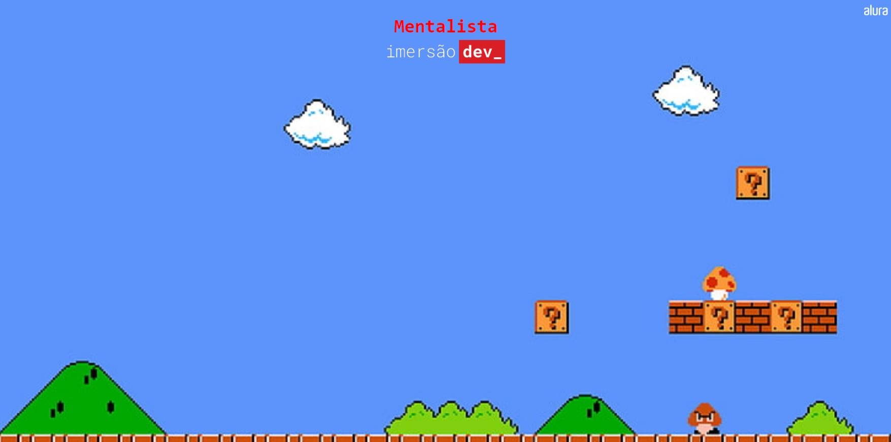

# Mentalist Game

Esse projeto consiste em um jogo de adivinhação, onde o programa escolhe um número aleatório e o usuário tenta acertar. Vão ser utilizadas ferramentas de lógica de programação, que podem ser utilizadas juntas e que permitem que nossos programas sigam por diversos caminhos, de acordo com as informações e dados recebidos.

- Podemos aplicar uma quantidade chave de vidas para chegar no "game over"
- É dado a dica de "o número é maior" ou "o número é menor" que o número certo.

## Tecnologias utilizadas

> - HTML
> - CSS
> - JavaScript

## Tela Principal

